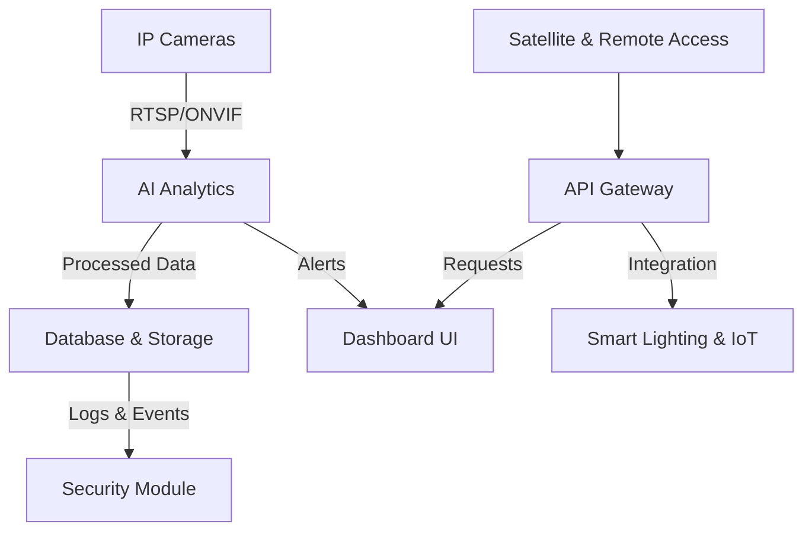

# 📡 Smart Camera Network - The Future of Urban Surveillance

## 🚀 Introduction
**Smart Camera Network (SCN)** is an **AI-powered, IoT-integrated** surveillance system designed for **real-time monitoring, security automation, and smart city integration**. The platform combines **real-time camera scanning**, **AI-driven analytics**, **smart lighting control**, and **secure remote access**, making it a cutting-edge solution for public and private security.

SCN is modular, scalable, and built to disrupt traditional surveillance systems by providing **high-level automation**, **interoperability**, and **real-time intelligence** for enhanced security operations.

## 🔥 Key Features
- **📡 Real-Time Camera Scanning & Identification**: Auto-detection of IP cameras and ONVIF-supported devices.
- **🤖 AI-Powered Facial & License Plate Recognition**: Deep learning models for facial identification and Automatic Number Plate Recognition (ANPR).
- **💡 Smart Lighting Integration**: IoT-controlled lighting adjustments based on detected activity.
- **🔐 Secure Network & Access Automation**: Encrypted communications, automatic authentication bypass, and brute-force protection.
- **📊 Intuitive Dashboard & Live Monitoring**: Web-based UI for seamless camera management and data visualization.
- **🔗 API Connectivity & Interoperability**: RESTful API for integration with third-party systems.
- **🛡️ Advanced Security & Log Auditing**: Detailed tracking of user actions, alerts, and system access.
- **🛰️ Satellite & Remote Access Support**: Secure connectivity even in isolated or network-limited environments.

---

## 🏗 Architecture Overview
SCN follows a **modular microservices-based architecture**, ensuring **high availability, scalability, and security**. The system is designed to work across **on-premises, cloud, and hybrid deployments**.

### **Core Components:**
1. **Camera Discovery Module**: Scans and identifies IP cameras in the network.
2. **AI Analytics Module**: Processes video streams for facial recognition, ANPR, and anomaly detection.
3. **IoT Integration Layer**: Communicates with smart lighting and other IoT devices.
4. **API Gateway**: Manages authentication, access control, and data exchange.
5. **Web Dashboard**: Provides a real-time UI for users to interact with the system.
6. **Security & Log Auditing**: Tracks all actions, system events, and user interactions.
7. **Remote Connectivity (Satellite & Cloud)**: Ensures secure access from anywhere in the world.



---

## 📦 Installation
### **1️⃣ Requirements**
- Python 3.8+
- Docker (for containerized deployment)
- Node.js (for dashboard frontend)
- ONVIF-compatible cameras (optional)

### **2️⃣ Installation Steps**
#### **For Local Installation:**
```bash
git clone https://github.com/your-org/smart-camera-network.git
cd smart-camera-network
pip install -r requirements.txt
npm install --prefix dashboard/
python manage.py runserver
```

#### **For Docker Deployment:**
```bash
docker-compose up -d
```

#### **For Kubernetes Deployment:**
```bash
kubectl apply -f k8s-deployment.yaml
```

---

## 📡 API Usage
SCN provides a **RESTful API** to interact with cameras, users, and events.

### **Example API Calls:**
#### **Get List of Cameras**
```bash
curl -X GET "https://api.smartcameranetwork.com/cameras" -H "Authorization: Bearer <TOKEN>"
```
#### **Trigger an AI Event (Face Recognition Scan)**
```bash
curl -X POST "https://api.smartcameranetwork.com/ai/scan" \
     -H "Authorization: Bearer <TOKEN>" \
     -d '{"camera_id": 1, "scan_type": "face"}'
```
#### **Retrieve AI-Detected Events**
```bash
curl -X GET "https://api.smartcameranetwork.com/events" -H "Authorization: Bearer <TOKEN>"
```

Full API documentation available [here](https://docs.smartcameranetwork.com).

---

## 🛡️ Security Features
- **End-to-End Encryption (TLS 1.3)**
- **Role-Based Access Control (RBAC)**
- **Multi-Factor Authentication (MFA) support**
- **Automatic Log & Event Auditing**
- **DDoS & Brute Force Protection Mechanisms**
- **Secure Key & Token Management**

---

## 📅 Roadmap
✅ **Q1 2025**: Beta release with core functionalities.  
✅ **Q2 2025**: AI-based anomaly detection & event correlation.  
🔜 **Q3 2025**: Machine learning model improvements & self-learning analytics.  
🔜 **Q4 2025**: Full satellite communication support & autonomous IoT actions.  

---

## 🤝 Contributing
We welcome contributions from developers, AI researchers, and security experts.
- Fork the repository
- Create a feature branch (`git checkout -b feature-xyz`)
- Commit your changes (`git commit -m 'Add feature XYZ'`)
- Push to the branch (`git push origin feature-xyz`)
- Open a pull request

Join our [Discord Community](https://discord.gg/smartcameranetwork) to discuss development!

---

## ⚖️ License
This project is licensed under the **Apache 2.0 License**. See [LICENSE](LICENSE) for details.

---

## 🌍 Contact
- 📧 Email: support@smartcameranetwork.com
- 🌎 Website: [smartcameranetwork.com](https://smartcameranetwork.com)
- 🐙 GitHub: [github.com/smartcameranetwork](https://github.com/smartcameranetwork)
- 📢 Twitter: [@smartcameranet](https://twitter.com/smartcameranet)

---

### **💡 The Future of Urban Surveillance is Here. Join Us.** 🚀